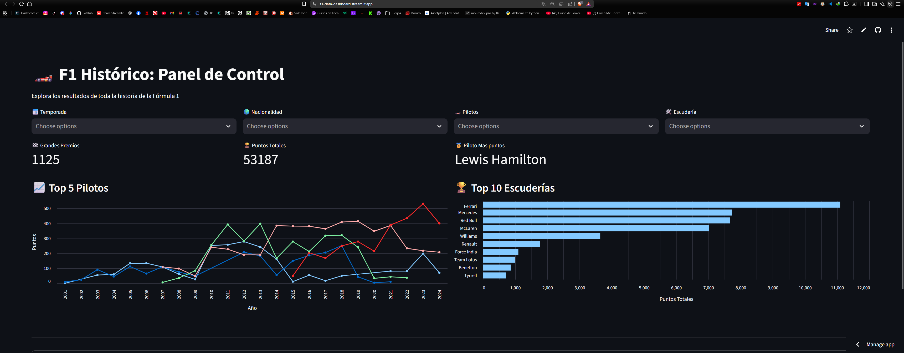

# 🏎️ F1 Historic Dashboard: Análisis de 70 Años de Datos

[](https://f1-data-dashboard.streamlit.app/)



### 📋 Descripción
Herramienta interactiva de Inteligencia de Negocios (BI) desarrollada para analizar el rendimiento histórico de la Fórmula 1. Utiliza una base de datos SQL procesada mediante un pipeline ETL propio para visualizar estadísticas de pilotos, escuderías y temporadas desde 1950 hasta la actualidad.

### 🚀 Funcionalidades Principales
* **KPIs Dinámicos:** Cálculo en tiempo real de puntos totales, carreras y métricas de rendimiento.
* **Filtros en Cascada:** Selección inteligente de Temporada -> Nacionalidad -> Pilotos -> Escuderías.
* **Visualización Comparativa:**
    * Evolución temporal de pilotos (Line Chart).
    * Ranking de Escuderías ordenado por rendimiento (Bar Chart horizontal).
* **Data Cleaning:** Algoritmos de limpieza para normalizar nacionalidades y corregir inconsistencias históricas.

### 🛠️ Tecnologías Utilizadas
* **Python:** Lenguaje principal.
* **Streamlit:** Framework para el despliegue de la Web App.
* **Pandas:** Manipulación y limpieza de datos (ETL).
* **Altair:** Visualización de datos avanzada.
* **SQLite:** Gestión de base de datos relacional.

### 📂 Estructura del Proyecto
* `app.py`: Código fuente del Dashboard.
* `setup_db.py`: Script ETL para la creación de la base de datos.
* `data/`: Contiene la base de datos SQLite y los archivos fuente CSV.

### 💻 Cómo ejecutar este proyecto localmente
Si deseas clonar y correr este dashboard en tu computadora, usa estos comandos en tu terminal:

```bash
git clone https://github.com/josue-guillen-dev/F1-Data-Pipeline
pip install -r requirements.txt
streamlit run app.py 
```

### 👨‍💻 Autor
 Josue Guillen - Analista de Datos en formación 🦁
 ---
*Este proyecto es parte de mi portafolio profesional de Análisis de Datos.*