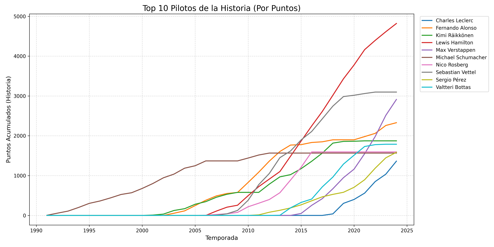
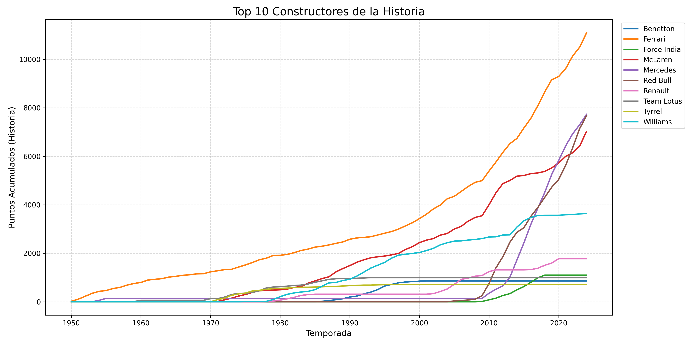

# 🏎️ F1 Data Pipeline: ETL & Análisis Automatizado

> **Estado:** Completado v1.0
> **Rol:** Data Analyst / Data Engineer Junior

## 📋 Descripción del Proyecto
Este proyecto simula un entorno de **Ingeniería de Datos real**.
El objetivo fue construir un **Pipeline ETL (Extract, Transform, Load)** automatizado que:
1.  **Extrae** resultados históricos de Fórmula 1 desde una base de datos SQL.
2.  **Transforma** y limpia los datos usando Python (Pandas), eliminando errores y nulos.
3.  **Carga** los resultados generando reportes de negocio visuales automáticamente.

El sistema reemplaza el análisis manual en Excel por un script ejecutable que estandariza la calidad de los datos.

## ⚙️ ¿Cómo funciona el flujo?
El dato viaja de la siguiente manera:
`[Base de Datos SQL] --> [Script de Python] --> [Reporte Final (Excel + PNG)]`

## 🚀 Funcionalidades Clave
* **Modularización:** Código separado en lógica de negocio (`f1_tools.py`) y ejecución (`main.py`) para ser escalable.
* **Conexión SQL Dinámica:** Consultas adaptables según la elección del usuario (Pilotos vs. Constructores).
* **Limpieza Automatizada:** Tratamiento de valores nulos (`NaN`) y conversión de tipos de datos (Casting).
* **Exportación Inteligente:** Los archivos se guardan automáticamente en carpetas organizadas.

## 🛠️ Tecnologías Usadas
* **Lenguaje:** Python 3.10+
* **Librerías:** Pandas, Matplotlib, SQLite3.
* **Base de Datos:** SQLite / SQL Standard.
* **Control de Versiones:** Git.

## 📂 Estructura del Proyecto
* `data/`: Fuente de verdad (DB y CSVs crudos).
* `export/`: Destino de reportes generados.
* `f1_tools.py`: Módulo de herramientas (Funciones ETL).
* `main.py`: Script principal.
* `README.md`: Documentación.

## 📊 Resultado Visual

*(Estos gráficos se actualizan automáticamente al correr el script)*

---
**Autor:** Josué - Analista de Datos en formación 🦁